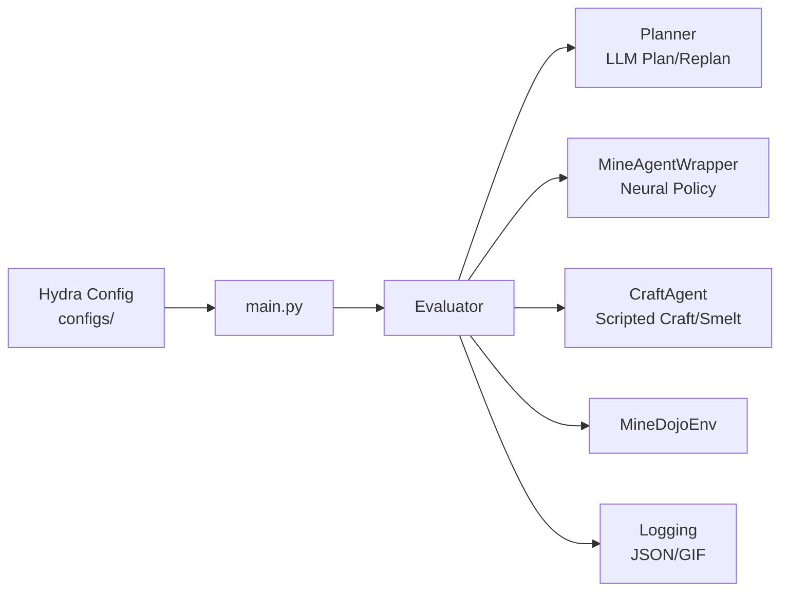
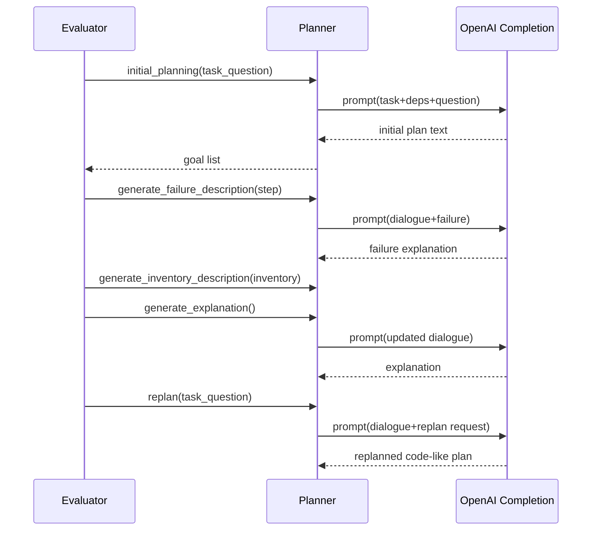
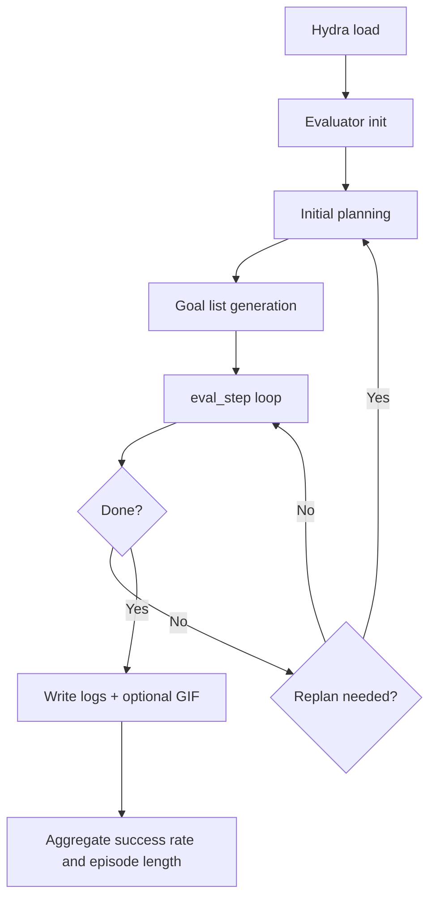

# DEPS Core Features (Diagram Edition)

このドキュメントは `docs/core_features.md` の内容を、図（Mermaid）付きで再構成した版です。

---

## 0. 全体像

DEPS は Minecraft 系タスクに対して、以下を統合する実行基盤です。

- LLM による高レベル計画（何をするか）
- ゴール条件付き方策モデルによる行動生成（どう動くか）
- craft/smelt の手続き制御
- 実行中の再計画とログ可視化

主な実行起点は `main.py` で、Hydra 設定 (`configs/`) を通じて挙動を切り替えます。



---

## 1. 評価オーケストレーション（`main.py` / `Evaluator`）

### 役割

- タスク評価の全体フローを統括
- 環境初期化、計画初期化、ステップ実行、成功判定、ログ出力を一元管理

### 実装方法

- `main.py` の `main()` が Hydra 設定を受け取り `Evaluator` を生成
- `Evaluator.__init__()` で環境 (`MineDojoEnv`)、Planner、Mine/Craft エージェントを初期化
- `single_task_evaluate()` が反復評価（成功率と平均ステップ長集計）を実行
- タスク情報は `data/task_info.json` から読み込み

### 目的

- 1コマンドで評価実行できる再現可能な評価基盤
- Hydra override による比較実験

---

## 2. LLM 計画生成・再計画（`planner.py`）

### 役割

- タスク自然言語から実行プランを生成
- 実行失敗時に状況説明を踏まえて再計画

### 実装方法

- `Planner.initial_planning()` が初期プランを生成
- `Planner.replan()` が失敗後の修正プランを生成
- `Planner.generate_failure_description()` / `generate_explanation()` が対話履歴を拡張
- `data/task_prompt.txt`、`data/deps_prompt.txt`、`data/parse_prompt.txt` を利用
- OpenAI API キーは `data/openai_keys.txt` を読み `update_key()` でローテーション

### 目的

- 固定手順で詰まりやすい長期タスクへの動的な計画修正能力



---

## 3. ゴール構造化と辞書マッピング（`goal_lib.json` / `goal_mapping.json`）

### 役割

- LLM のテキストプランを実行可能なゴール辞書へ変換
- 各ゴールを MineCLIP/CLIP/horizon 用語彙にマッピング

### 実装方法

- `Planner.generate_goal_list()` が計画テキストを行ごとに解析
- `data/goal_lib.json` が `type`, `precondition`, `tool`, `output` を定義
- `check_object()` で未登録 goal 名でも output object から補完
- `main.py` 側で `data/goal_mapping.json` を読み埋め込み参照用語へ変換

### 目的

- 自然言語計画を安定して実行段へ落とし込む

```mermaid
flowchart TD
    A[LLM Plan Text] --> B[generate_goal_list]
    B --> C[online_parser\n(parse_prompt few-shot)]
    C --> D{name in goal_lib?}
    D -- Yes --> E[Use goal_lib[name]]
    D -- No --> F[check_object by output item]
    F --> G[Fallback to supported_objects]
    E --> H[Goal Dict\n{name,type,object,precondition,ranking}]
    G --> H
    H --> I[goal_mapping.json lookup\nfor embedding prompt]
```

---

## 4. 階層制御ループ（mine / craft / smelt 切替）

### 役割

- ゴールタイプごとに最適な実行器へ分岐
- タスク進捗に応じたゴール遷移・再計画

### 実装方法

- `Evaluator.eval_step()` で `curr_goal["type"]` を判定
- `mine`: `MineAgentWrapper.get_action()`
- `craft` / `smelt`: `CraftAgent.get_action()`
- `check_inventory()` / `check_precondition()` / `check_done()` で状態判定
- 失敗条件（前提欠如・時間超過）で `replan_task()` を発火

### 目的

- ニューラル方策とルールベース手続きの長所を統合

```mermaid
flowchart TD
    A[eval_step loop] --> B{curr_goal.type}
    B -- mine --> C[MineAgentWrapper.get_action]
    B -- craft --> D[CraftAgent.get_action]
    B -- smelt --> D
    C --> E[env.step(action)]
    D --> E
    E --> F{goal/precondition/time checks}
    F -- goal done --> G[update_goal]
    F -- failure --> H[replan_task]
    F -- task done --> I[finish + log result]
    G --> A
    H --> A
```

---

## 5. Mine 行動ポリシー（`src/models/simple.py`）

### 役割

- 視覚観測 + ゴール + 補助観測から行動分布を予測する中核モデル

### 実装方法

- `SimpleNetwork` が policy 本体
- 画像特徴はバックボーン（Impala / GoalImpala / MineCLIP / ResNet）
- ゴール埋め込みは `nn.Linear`
- 融合方式は `rgb`, `concat`, `bilinear`, `film`
- 追加観測 `ExtraObsEmbedding`（biome, compass, gps, voxels）
- `use_prev_action` で前行動埋め込み追加
- 時系列は GRU または Transformer (`transformers.GPT2Model`)
- `use_horizon`/`use_pred_horizon` で horizon 予測ヘッド

### 目的

- 目標条件付き・時間文脈付きの行動選択

```mermaid
flowchart LR
    A[RGB / Voxels / Compass / GPS / Biome] --> B[Backbone Encoder]
    C[Goal Text Embedding] --> D[Goal Projection]
    B --> E[Fusion Layer]
    D --> E
    F[Prev Action Embedding (optional)] --> E
    G[ExtraObsEmbedding (optional)] --> E
    E --> H[Temporal Module\nGRU or Transformer]
    H --> I[Action Head]
    H --> J[Horizon Head (optional)]
```

---

## 6. 視覚バックボーンとゴール埋め込み（`controller.py` / `src/utils/vision.py`）

### 役割

- テキストゴールを埋め込み化し、視覚認識系と結合

### 実装方法

- `accquire_goal_embeddings()` が MineCLIP で goal text をエンコード
- `create_backbone()` が設定名でモデル生成
- `resize_image()` で入力解像度を調整
- `MineCLIPWrapper`, `ImpalaCNNWrapper`, `GoalImpalaCNNWrapper`, `ResNetWrapper`

### 目的

- goal semantics を視覚行動モデルへ注入

---

## 7. Craft/Smelt スクリプトエージェント（`controller.py` / `CraftAgent`）

### 役割

- crafting table / furnace を伴う手続きを安定実行
- 採掘系モデルが苦手な離散手順を補完

### 実装方法

- `CraftAgent` が action generator 群を提供
- `get_action()` が内部 iterator 状態を保持して段階実行
- `index_slot`（在庫確認）+ `look_to`（視点制御）で操作

### 目的

- 手順依存が強いクラフト処理の安定化

---

## 8. 進行管理と再計画トリガ（`Evaluator`）

### 役割

- 現在ゴールの達成可否を監視し次ゴールへ遷移
- 行き詰まり時に再計画を自動発火

### 実装方法

- `update_goal()` がインベントリ達成時に前進
- `replan_task()` が failure + inventory + explanation を経由
- ゴール種別ごとの時間閾値で再計画
- 再計画回数の上限超過で打ち切り

### 目的

- 1回の失敗で全体失敗とならないロバスト実行

---

## 9. ログ記録と GIF 可視化（`main.py`）

### 役割

- 計画・ゴール・対話・結果を追跡可能にする
- 成功/失敗の事後解析を容易にする

### 実装方法

- `Evaluator.logging()` で `self.logs` にステップ状態を保存
- `logs/<timestamp>_<task>.json` に逐次書き込み
- `record.frames=True` で RGB フレーム蓄積・GIF 化
- `recordings/<timestamp>/<task>.gif` と対応 JSON 保存

### 目的

- 再現性・分析性・デバッグ性を向上

```mermaid
flowchart LR
    A[Step t] --> B[logging(t)]
    B --> C[self.logs update]
    C --> D[logs/<timestamp>_<task>.json]
    A --> E{record.frames}
    E -- true --> F[append RGB frame]
    F --> G[save GIF + JSON]
```

---

## 10. Hydra 設定駆動の実験管理（`configs/`）

### 役割

- データ条件・モデル条件・評価条件を宣言的に管理
- CLI から高速に条件切替

### 実装方法

- `configs/defaults.yaml` が `data/model/eval/goal_model` の既定を合成
- `configs/goal_model/*.yaml` で goal_model モード切替
- `python main.py key=value` で override

### 目的

- コード変更なしで比較実験/アブレーションを実行

---

## 11. データ処理ユーティリティ（`src/utils`）

### 役割

- 学習/評価データの整理、変換、統計、可視化を補助

### 実装方法

- `group.py`: accomplishments ベースで trajectory をゴール別分割
- `json2lmdb.py`: JSON trajectory を LMDB へ並列変換
- `statistic.py`: データ件数統計
- `visualize_trajs.py`: trajectory を MP4 可視化

### 目的

- データ基盤整備の自動化

---

## 12. 未実装インターフェース（`selector.py`）

### 役割

- 将来の候補ゴール選択ロジックの差し込み点

### 実装方法

- `Selector` に `check_precondition`, `generate_candidate_goal_list`, `horizon_select`
- 現状は `NotImplementedError`

### 目的

- 高度な goal selector へ拡張しやすい設計

---

## 機能間の実行フロー

1. `main.py` が Hydra 設定を読み `Evaluator` を初期化
2. `Planner` がタスク文から初期計画を生成しゴール列へ構造化
3. `Evaluator.eval_step()` がゴール種別に応じ mine/craft/smelt を切替実行
4. 在庫・前提条件を監視し、必要時に再計画
5. 結果を JSON/GIF に保存し、成功率とエピソード長を集計



---

## この設計の狙い（要約）

- LLM の柔軟な計画能力と、方策モデル/スクリプト制御の実行確実性を組み合わせる
- 実行中に再計画可能なループでオープンワールド環境の失敗耐性を上げる
- Hydra とログ基盤で再現性・比較可能性を担保する
